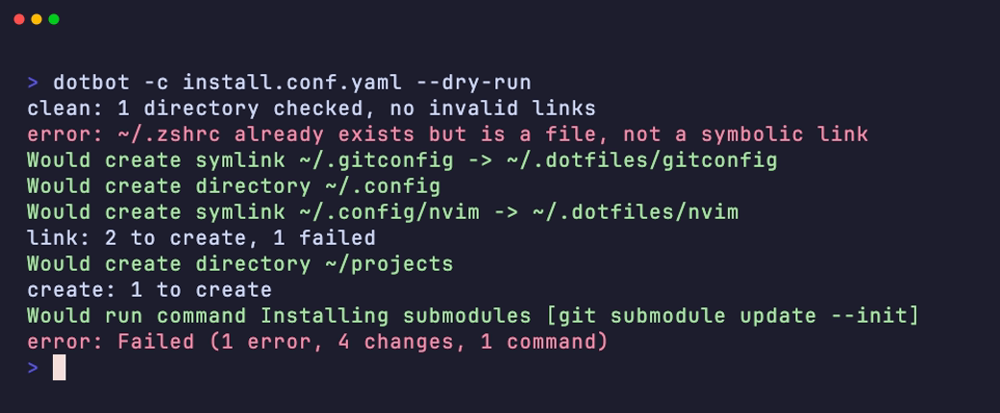

<h1 align="center">Dotbot</h1>

<p align="center">Install your dotfiles with one command, even on a new machine.</p>

<p align="center">
  <a href="https://github.com/pgilad/dotbot/actions/workflows/ci.yml"></a>
  <a href="https://github.com/pgilad/dotbot/releases"></a>
  <a href="LICENSE.md"></a>
</p>

<p align="center">
  
</p>

Dotbot reads a YAML file that tells it where your dotfiles go. It links the files into place, creates directories, and runs setup commands. It does less than you think, because version control does more than you think: Dotbot works with any VCS and doesn't manage your repository.

- **One file.** Your setup is a short YAML file next to your dotfiles.
- **Safe.** Dotbot doesn't replace your files unless you tell it to. `--dry-run` shows the changes first.
- **Idempotent.** Run it again after each `git pull`. Correct links stay as they are.
- **Small.** Dotbot needs only Python and PyYAML.
- **Extensible.** [Plugins](docs/plugins.md) add Homebrew, apt, secrets, and more.

## Install

```sh
uv tool install git+https://github.com/pgilad/dotbot
```

[uv] downloads Python 3.14+ if necessary. To pin a [release], add its tag to the URL, for example `git+https://github.com/pgilad/dotbot@v3.2.0`. To upgrade, run `uv tool upgrade dotbot`.

> [!NOTE]
> Dotbot isn't on PyPI: the `dotbot` package on PyPI is a different project. On Windows, your account must be [allowed to create symbolic links][windows-symlinks].

## Quick start

Add `install.conf.yaml` to your dotfiles repository:

```yaml
- defaults:
    link:
      create: true  # make parent directories
      relink: true  # replace old symbolic links

- clean: ['~']  # remove dead links to your dotfiles

- link:
    ~/.zshrc: zshrc  # ~/.zshrc -> ~/.dotfiles/zshrc
    ~/.gitconfig: gitconfig
    ~/.config/nvim: nvim

- create:
    - ~/projects

- shell:
    - [git submodule update --init, Installing submodules]
```

Then run it:

```sh
dotbot -c install.conf.yaml
```

To install your dotfiles on a new machine:

```sh
git clone https://github.com/<you>/dotfiles ~/.dotfiles
cd ~/.dotfiles
dotbot -c install.conf.yaml
```

To get changes later, run `git pull` and then Dotbot again.

<details>
<summary>Bootstrap a machine that has only uv</summary>

Add this `install` script to your dotfiles. It runs Dotbot without installing it:

```sh
#!/usr/bin/env sh
set -e
cd "$(dirname "$0")"
exec uvx --from git+https://github.com/pgilad/dotbot dotbot -c install.conf.yaml "$@"
```

To always use the same version of Dotbot, add a release tag to the URL.

</details>

## Configuration

A configuration is a list of tasks. Dotbot runs them in order. Paths in your dotfiles are relative to the directory of the configuration file.

| Directive | Description |
| --- | --- |
| [`link`](docs/configuration.md#link) | Link files and directories into place (symbolic links, hard links, or copies). |
| [`create`](docs/configuration.md#create) | Create directories. |
| [`shell`](docs/configuration.md#shell) | Run shell commands. |
| [`clean`](docs/configuration.md#clean) | Remove dead symbolic links. |
| [`defaults`](docs/configuration.md#defaults) | Set the default options of the tasks that follow. |
| [`plugins`](docs/plugins.md) | Load plugins that add directives. |

The [configuration reference](docs/configuration.md) has all the options and more examples.

## Usage

Use `--dry-run` to see the changes first. Here, Dotbot doesn't replace `~/.zshrc`, because it's a file and not a link. To replace it, set `force: true`, or `backup: true` to keep a copy.

<p align="center">
  
</p>

| Option | Description |
| --- | --- |
| `-c`, `--config-file FILE...` | Run the tasks in these configuration files. |
| `-n`, `--dry-run` | Show what Dotbot would do, but change nothing. |
| `--only DIRECTIVE...` | Run only these directives. |
| `--except DIRECTIVE...` | Run all the directives except these. |
| `-x`, `--exit-on-failure` | Stop after the first failed directive. |
| `-d`, `--base-directory DIR` | Use `DIR` for relative paths, not the directory of the first configuration file. |
| `-p`, `--plugin PATH` | Load a plugin file or directory. |
| `-q`, `-v`, `-vv` | Show less output, or more. |

`dotbot --help` shows all the options.

## Contributing

Feature requests, bug reports, and patches are welcome. See [CONTRIBUTING.md](CONTRIBUTING.md).

## License

Copyright (c) Anish Athalye and Gilad Peleg. Released under the [MIT License](LICENSE.md).

This project started as a fork of [Dotbot](https://github.com/anishathalye/dotbot) by Anish Athalye.

[uv]: https://docs.astral.sh/uv/
[release]: https://github.com/pgilad/dotbot/releases
[windows-symlinks]: https://learn.microsoft.com/en-us/windows/security/threat-protection/security-policy-settings/create-symbolic-links
